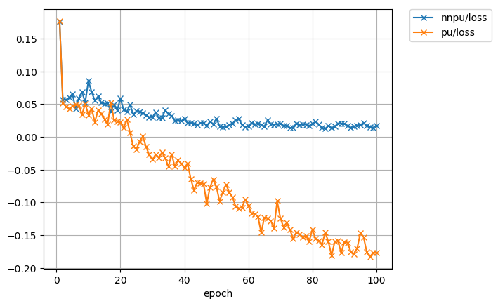
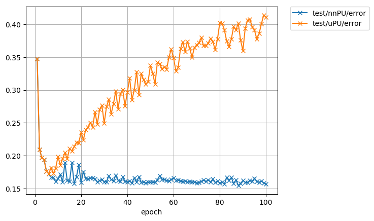

# Chainer implementation of non-negative PU learning and unbiased PU learning
This is a reproducing code for non-negative PU learning [1] and unbiased PU learning [2] in the paper "Positive-Unlabeled Learning with Non-Negative Risk Estimator".

* ```pu_loss.py``` has a chainer implementation of the risk estimator for non-negative PU (nnPU) learning and unbiased PU (uPU) learning. 
* ```train.py``` is an example code of nnPU learning and uPU learning. 
Dataset are MNIST [3] preprocessed in such a way that even digits form the P class and odd digits form the N class and
CIFAR10 [4] preprocessed in such a way that artifacts form the P class and living things form the N class.
The default setting is 100 P data and 59900 U data of MNIST, and the class prior is the ratio of P class data in U data.

## Requirements
* Python == 3.7
* Numpy == 1.16
* Chainer == 6.4
* Scikit-learn == 0.21
* Matplotlib == 3.0

## Quick start
You can run an example code of MNIST for comparing the performance of nnPU learning and uPU learning on GPU.

    python3 train.py -g 0

There are also preset configurations for reproducing results on [1].
* ``--preset figure1``: The setting of Figure 1
* ``--preset exp-mnist``: The setting of MNIST experiment in Experiment
* ``--preset exp-cifar``: The setting of CIFAR10 experiment in Experiment

You can see additional information by adding ```--help```.

## Example result
After running ```training_mnist.py```, 2 figures and 1 log file are made in ```result/``` by default.
The errors are measured by zero-one loss.
* Training error in ```result/training_error.png```



* Test error in ```result/test_error.png```



## Reference

[1] Ryuichi Kiryo, Gang Niu, Marthinus Christoffel du Plessis, and Masashi Sugiyama. 
"Positive-Unlabeled Learning with Non-Negative Risk Estimator." Advances in neural information processing systems. 2017.

[2] Marthinus Christoffel du Plessis, Gang Niu, and Masashi Sugiyama. 
"Convex formulation for learning from positive and unlabeled data." 
Proceedings of The 32nd International Conference on Machine Learning. 2015.

[3] LeCun, Yann. "The MNIST database of handwritten digits." http://yann.lecun.com/exdb/mnist/ (1998).

[4] Krizhevsky, Alex, and Geoffrey Hinton. "Learning multiple layers of features from tiny images." (2009).
